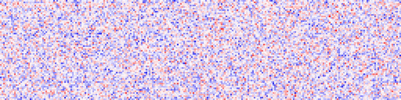

# Keras Weight Animator

Save [Keras](http://keras.io) weight matrices as short animated videos to better understand what and how your neural network models are learning. Below are examples of the first LSTM layer and the final output layer of a six-class RNN model trained over one epoch. Blue represents low values and red represents high values.




## Getting Started

### Dependencies

```bash
# clone the repo, preferably somewhere in your PYTHONPATH
git clone https://github.com/brannondorsey/keras_weight_animator
cd keras_weight_animator

pip install -r requirements.txt
```

In order to render videos from the saved weight images you must also have the following packages installed on your machine:

- [GNU Parallel](https://www.gnu.org/software/parallel/)
- [ImageMagick](https://www.imagemagick.org/script/index.php)
- [FFmpeg](https://ffmpeg.org/download.html)

### Using the Module

This module is named `keras_weight_animator`. It exposes a [Keras callback](https://keras.io/callbacks/) function that you can include in any model `fit(...)` method.

```python
## you can optionally add this module to your python path by appending
## its parent directory in sys.path. Uncomment below to do this.
# import sys
# sys.path.append('path/to/keras_weight_animator/..')

from keras_weight_animator import image_saver_callback

# assumes a keras model named "model"
callbacks = [image_saver_callback(model, 'output_directory')]

model.fit(X_train, y_train, callbacks=callbacks)
```

The two required parameters to `image_saver_callback(...)` are the Keras `model` and an `output_directory` to periodically save weight images to. By default, `keras_weight_animator` saves layer weights every 100 batches to `output_directory` as PNGs in folders named `epoch_XXX-layer_NAME-weights_YY`. Once training is complete, you can optionally create short animated video clips from the image sequences saved in `output_directory` using [`bin/create_image_sequence.sh](bin/create_image_sequence.sh) path/to/output_directory`. This will use `parallel`, `mogrify`, and `ffmpeg` to create a `.mp4` from the image sequences located in each folder of `output_directory`. Video files will be named like `epoch_XXX-layer_NAME-weights_YY.mp4`. You can run this script automatically from your training script by passing the `render_videos=True` parameter to `image_saver_callback(...)`.

## Optional Parameters

`weight_image_sequences(...)` takes a variety of optional keyword arguments.

- `epoch_interval` (default=`1`): Save weight images every `epoch_interval` epochs. Saves weights every epoch by default, but you may want to change this if you are training for lots of epochs.
- `batch_interval` (default=`100`): Save weight images every `batch_interval` batches. `batch_interval=1` would save weights for every batch.
- `cmap` (default='gray'): [Matplotlib color map](http://matplotlib.org/users/colormaps.html) name. I recommend trying some diverging color maps, especially `RdBu`.
- `render_videos` (default=`False`): Optionally make a system call to `create_image_sequences.sh <output_directory>` at the end of `model.fit()` (using the Keras `on_train_end(...)` function internally). Setting this to `True` will automagically render `.mp4` videos for you (watch the console for errors).

```bash
# example
callbacks = [image_saver_callback(model, 'weight_image_sequences', epoch_interval=10, batch_interval=1000, cmap='gray', render_videos=True)]
model.fit(X_train, y_train, callbacks=callbacks)
```

## Examples

I've included an example usage of the module in [`examples/wisdm.py`](example/wisdm.py). This example uses smartphone accelerometer data from [WISDM](http://www.cis.fordham.edu/wisdm/dataset.php) to classify human activity tasks like walking, standing, sitting, walking upstairs, etc...

This example uses a one layer LSTM to classify a set of 60 data points (representing three seconds of data sampled at 20hz) as belonging to one of six classes. It outputs image sequences and videos to `data/wisdm`.

```bash
# download and uncompress the WISDM data
cd data
curl http://www.cis.fordham.edu/wisdm/includes/datasets/latest/WISDM_ar_latest.tar.gz -o WISDM_ar_latest.tar.gz
tar -xzf WISDM_ar_latest.tar.gz
rm WISDM_ar_latest.tar.gz
cd ../example

python wisdm.py
```

## Thoughts

Using a bash script to leverage parallel, ImageMagick, and FFMPEG isn't necessarily the most elegant solution, but its the one I had time for. The goal of this here lil' project was to write a quick tool that allows me to better understand how weights change over mini-batch updates in a variety of neural networks. Perhaps in the future I will come back and clean up some of the inelegancies. If you have interest in contributing or maintaining a cleaner version of this lib, please reach out at <brannon@brannondorsey.com>.

## Attribution and License

This module is © Brannon Dorsey 2017, released under an ♥ MIT License ♥. You are free to use, modify, distribute, sell, etc... this software under [those terms](LICENSE).

Example data is from the WIreless Sensor Datamining (WISDM) Actitracker dataset published by Fordham University:

```
Jennifer R. Kwapisz, Gary M. Weiss and Samuel A. Moore (2010). Activity Recognition using Cell Phone Accelerometers, Proceedings of the Fourth International Workshop on Knowledge Discovery from Sensor Data (at KDD-10), Washington DC. [PDF]
```

This idea is tangentially inspired by much of the work on [Visualizing and Understanding Recurrent Networks](https://arxiv.org/abs/1506.02078) by Andrej Karpathy, Justin Johnson, and Fei-Fei Li.

```
@article{DBLP:journals/corr/KarpathyJL15,
  author    = {Andrej Karpathy and
               Justin Johnson and
               Fei{-}Fei Li},
  title     = {Visualizing and Understanding Recurrent Networks},
  journal   = {CoRR},
  volume    = {abs/1506.02078},
  year      = {2015},
  url       = {http://arxiv.org/abs/1506.02078},
  timestamp = {Wed, 07 Jun 2017 14:42:54 +0200},
  biburl    = {http://dblp.uni-trier.de/rec/bib/journals/corr/KarpathyJL15},
  bibsource = {dblp computer science bibliography, http://dblp.org}
}
```

GNU Parallel is adamant about citation to the point of excess IMHO, but for what its worth, here is their bibtex:

```
@article{Tange2011a,
  title = {GNU Parallel - The Command-Line Power Tool},
  author = {O. Tange},
  address = {Frederiksberg, Denmark},
  journal = {;login: The USENIX Magazine},
  month = {Feb},
  number = {1},
  volume = {36},
  url = {http://www.gnu.org/s/parallel},
  year = {2011},
  pages = {42-47},
  doi = {http://dx.doi.org/10.5281/zenodo.16303}
}

```
